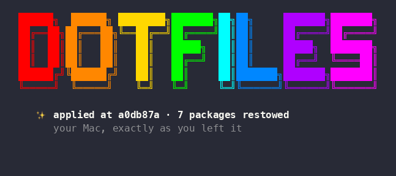

# dotfiles-update

[](https://github.com/ccollins/dotfiles-update/actions/workflows/ci.yml)

An [Oh My Zsh](https://ohmyz.sh)–style update check for a **Git-managed dotfiles repo**,
modeled on OMZ's own `tools/check_for_upgrade.sh`. It keeps your dotfiles honest by
surfacing, on each interactive shell startup, whether your repo has drifted — and offers
to fix it.

It's the reusable core extracted from a personal [GNU stow](https://www.gnu.org/software/stow/)
dotfiles setup. Works with or without stow.


## What it does

On each interactive startup it checks three **independent** signals for your dotfiles
repo (`$DOTFILES`, default `~/dotfiles`):

| Signal | Compares | Network? | Offers |
|--------|----------|----------|--------|
| **Uncommitted / unpushed** | working tree & upstream | no | a warning |
| **Not applied** | local `HEAD` vs the last *applied* commit | no | `dotfiles-apply` (restow) |
| **Update available** | local vs the tracked remote branch | yes (throttled) | `dotfiles-update` (pull), which prints a changelog of what it pulled |
| **Plugin update** | this plugin's own checkout vs its remote | yes (throttled) | `dotfiles-plugin-update` + a changelog link |

The **"plugin update"** signal is the plugin dogfooding itself: it checks whether the
installed copy of *this plugin* is behind its own remote and tells you the same way it
tells you about your dotfiles. That's how plugin updates reach you without re-running
your whole bootstrap. Defaults to `reminder` mode (just tells you; doesn't act).

The **"not applied"** signal is the interesting one: a marker file records the commit you
last *applied* to the machine (restowed / bootstrapped). If you `git pull` or commit and
haven't re-applied, a new shell tells you — because your symlinks, new packages, or
Brewfile may be stale even though the repo moved.

The **"update available"** signal is throttled (default: once per day) and reads the
remote HEAD with `git ls-remote`, so it works for **public and private** repos using your
existing git credentials — no `gh` or GitHub API token required.

## Install

Set your config **before** `source $ZSH/oh-my-zsh.sh` (same convention as OMZ's update
zstyles), then load the plugin one of these ways.

### Oh My Zsh custom plugin (recommended)

```zsh
git clone https://github.com/ccollins/dotfiles-update \
  ${ZSH_CUSTOM:-$HOME/.oh-my-zsh/custom}/plugins/dotfiles-update
```

Then in `.zshrc`, before the OMZ source line:

```zsh
export DOTFILES=$HOME/dotfiles
DOTFILES_PACKAGES=(shell git ssh)          # your stow packages (see "Applying" below)
plugins=(... dotfiles-update)
```

### Plain source (no framework)

```zsh
export DOTFILES=$HOME/dotfiles
DOTFILES_PACKAGES=(shell git ssh)
source /path/to/dotfiles-update.plugin.zsh
```

### Git submodule (pin the exact commit in your dotfiles repo)

```zsh
git submodule add https://github.com/ccollins/dotfiles-update \
  ${ZSH_CUSTOM:-$HOME/.oh-my-zsh/custom}/plugins/dotfiles-update
```

## Configuration

All optional; sensible defaults shown.

```zsh
export DOTFILES=$HOME/dotfiles              # path to your dotfiles repo
DOTFILES_PACKAGES=(shell git ssh)           # stow packages to restow on "apply"

zstyle ':dotfiles:update' mode      prompt   # prompt(default) | auto | reminder | disabled
zstyle ':dotfiles:apply'  mode      prompt   # prompt(default) | auto | reminder | disabled
zstyle ':dotfiles:plugin' mode      reminder # self-update: prompt | auto | reminder(default) | disabled
zstyle ':dotfiles:banner' mode      fancy    # fancy(default) | plain — the ASCII banner
zstyle ':dotfiles:update' frequency 1        # days between remote checks (throttle)
zstyle ':dotfiles:update' remote    origin   # remote name
zstyle ':dotfiles:update' branch    main     # tracked branch
zstyle ':dotfiles:changelog' limit  50       # commits listed after an update
```

Modes (borrowed verbatim from OMZ):

- **`prompt`** — ask `[Y/n]` before acting.
- **`auto`** — act automatically (pull / restow) without asking.
- **`reminder`** — just print how to do it manually.
- **`disabled`** — turn that signal off.

`:dotfiles:update` governs pulling remote updates; `:dotfiles:apply` governs restowing
after your local `HEAD` moves. They're independent.

## Applying (restow vs. custom)

The **apply** step is how the repo becomes live on the machine.

- **Stow users:** set `DOTFILES_PACKAGES` to your stow package directories.
  `dotfiles-apply` runs `stow --restow` for each.
- **Post-apply hook:** define a `dotfiles-apply-hook` function for apply steps stow can't
  express (e.g. generating a config file from a tracked template). It runs **after** the
  restow when `DOTFILES_PACKAGES` is set, or **instead** of stow when it isn't. Return
  non-zero to abort:

  ```zsh
  dotfiles-apply-hook() { "$DOTFILES/install.sh"; }   # non-stow: this IS the apply
  # or, alongside stow packages, a post-step:
  dotfiles-apply-hook() { my-settings-sync; }         # runs after `stow --restow`
  ```

- If neither `DOTFILES_PACKAGES` nor a hook is set, the **not-applied** signal is disabled
  (nothing to restow), but the uncommitted/unpushed and update-available signals still work.

Record the applied commit from your bootstrap/install script so the marker starts correct:

```sh
git -C "$DOTFILES" rev-parse HEAD > "${ZSH_CACHE_DIR:-$HOME/.cache/dotfiles-update}/.dotfiles-installed"
```

## Commands

One entry point, **`dotfiles <subcommand>`**:

- **`dotfiles status`** — on-demand state of every axis (dirty · unpushed · not-applied ·
  behind · plugin), ignoring the startup throttle. "Where do I stand right now?"
- **`dotfiles doctor`** — check the setup is healthy (git/jq/timeout present, repo on the
  tracked branch, plugin is a git checkout, engine on PATH, cache writable). Great on a
  fresh machine.
- **`dotfiles vendored`** — check vendored (pinned) dependencies for upstream updates
  (see "Checking vendored dependencies" below).
- **`dotfiles changelog [from [to]]`**: what changed, in the Oh My Zsh post-update
  format (see "The changelog" below). With no arguments it shows what has landed since
  the commit last applied to this machine.
- **`dotfiles update`** / **`apply`** / **`plugin-update`** — see below.
- **`dotfiles help`**.

### The changelog

`dotfiles update` prints what it just pulled, the way `omz update` does, instead of
leaving you to open a compare URL:

```
Updating dotfiles
main  c8bc438..baa987c

Features:

  - 96baf69 [shell]         Add fzf keybindings (#3)

Bug fixes:

  - c454543                 Stop stowing the dead symlink (#5)

Changes:

  - baa987c                 Global instructions: rules for prose that doesn't read as AI (#23)
  - 9c36cc5 [Brewfile]      Self-trust vendor taps, capture actionlint and PDF viewer (#22)
  - f5d10ec [rfc-architect] Hold vendor ADRs to a higher bar than in-house ones (#21)

  full diff: https://github.com/you/dotfiles/compare/c8bc438...baa987c
```

Subjects are read two ways, because dotfiles repos split about evenly between the
conventions:

- A **Conventional Commit** (`feat(shell): add fzf keybindings`) is filed under its type,
  so you get the familiar `Features:` / `Bug fixes:` headings, with the scope in brackets.
- A plain **`scope: subject`** prefix (`Brewfile: add ripgrep`) is not a type, so the
  commit lands under `Changes:` with `[Brewfile]` as its tag. Repos that never write
  conventional commits get one clean list rather than an empty set of headings.
- A subject with neither prefix still lists, untagged.

A trailing `(#123)` from a squash merge is pulled out and colored like a PR reference.
Within a group, unscoped commits come first in date order and scoped ones follow
alphabetically, which is what keeps the `[scope]` column readable down the page.

`dotfiles plugin-update` prints the same thing for the plugin's own checkout. Color is
dropped when stdout is not a terminal, when `NO_COLOR` is set, or below 8 colors. Long
ranges are capped:

```zsh
zstyle ':dotfiles:changelog' limit 50   # commits listed before "... and N more"
```

One thing it deliberately does not do: the **startup** notice still links a GitHub compare
URL rather than listing commits. At that point the check has only asked `git ls-remote`
for the remote SHA, and the commits themselves are not in your object store yet. Listing
them would mean a real `git fetch` on every shell start, which is the cost this plugin
exists to avoid.

### The banner

Applying, self-updating, and an all-green `dotfiles status` end in a rainbow
`dotfiles` banner — the same "you did the thing" moment Oh My Zsh gives you after
`upgrade_oh_my_zsh`, with a rotating tagline underneath:



It's 61 columns wide. Set `zstyle ':dotfiles:banner' mode plain` for the previous
one-line `✓ dotfiles applied at <sha>` output instead.

The art is a standalone script, **`dotfiles-banner`** (on `PATH` with the other bundled
tools), so your own install/bootstrap script can end on the same note:

```sh
dotfiles-banner "bootstrap complete" --tagline "welcome to the new Mac"
dotfiles-banner --no-tagline "all green"
```

Color is dropped automatically when stdout isn't a terminal, when `NO_COLOR` is set, or
when the terminal reports fewer than 8 colors.

The underlying commands (also callable directly):

- **`dotfiles-update`** — fast-forward pull the tracked branch, then apply. Refuses to
  run unless the repo is on the tracked branch (won't merge into a feature branch).
- **`dotfiles-apply`** — restow packages (or run your hook) and record the installed commit.
- **`dotfiles-plugin-update`** — fast-forward the plugin's own checkout; run `exec zsh`
  afterwards to load the new version. Requires the plugin to be a git clone (the default
  install); a vendored copy disables signal 4.

## Bundled tools: reconciling app-managed configs

Some tools **own and rewrite their own JSON config** (an editor/CLI that persists your
model/account/UI choices), so you can't stow a tracked copy in and machine-specific
choices shouldn't propagate. The plugin ships two small, **tool-agnostic** helpers for
this (added to `PATH` when the plugin loads):

- **`merge-managed-json <base> <live> [local-key…]`** — regenerate the app-owned `live`
  file from a tracked `base`: base wins for shared keys, while the listed **machine-local
  keys** are preserved from whatever the app last wrote. Only **top-level** keys are
  handled. If `live` has shared changes not in `base`, it prints a loud warning (never a
  silent revert) telling you to `capture` them.
- **`capture-managed-json <base> <live> [local-key…]`** — the inverse: promote `live`'s
  shared keys back into the tracked `base` (excluding the machine-local keys). Run it
  after you change shared settings in-app, then commit the base.

Wire them into your dotfiles repo by calling `merge-managed-json` from your install/apply
step, once per managed file.

### Example — Claude Code's `~/.claude/settings.json`

Claude Code rewrites that file via `/model` and `/config`. Share plugins/theme but keep
the per-machine `model` out of git:

```sh
# track the shared half once:
jq 'del(.model)' ~/.claude/settings.json > claude/settings.base.json

# reconcile on install/apply (keeps model per-machine):
merge-managed-json "$DOTFILES/claude/settings.base.json" "$HOME/.claude/settings.json" model

# later, after enabling a plugin in-app, promote it back to the base:
capture-managed-json "$DOTFILES/claude/settings.base.json" "$HOME/.claude/settings.json" model
```

The companion [`dotfiles-template`](https://github.com/ccollins/dotfiles-template) wires
this up for you with a `reconcile-managed` list.

## Checking vendored dependencies

When you copy an upstream thing into your dotfiles pinned to a commit (a skill, a
config, a script that has no package/marketplace), it's a **frozen fork** — nothing
tells you when upstream moves. `vendored-check` closes that.

Drop a **`.vendor`** file next to each vendored copy:

```sh
# ~/dotfiles/claude/.claude/skills/interview-coach/.vendor
repo=https://github.com/owner/name
ref=<full pinned commit sha>
branch=main
```

Then:

```zsh
vendored-check <dir> [<dir> ...]      # scans <dir>/*/.vendor, reports up-to-date / behind
```

Each behind entry prints a GitHub compare URL so you can eyeball the diff before
re-vendoring (which is a deliberate manual step — re-copy, then bump `ref`). It's
read-only and `git ls-remote`-based (no clone, timeout-guarded).

Expose it through the dispatcher by pointing `DOTFILES_VENDORED_DIRS` at the dirs that
hold your `.vendor` files (before the `oh-my-zsh.sh` source line):

```zsh
DOTFILES_VENDORED_DIRS=("$DOTFILES/claude/.claude/skills")
```

Now `dotfiles vendored` (no args) checks them all.

## Notes & FAQ

- **State files** live in `${ZSH_CACHE_DIR:-$HOME/.cache/dotfiles-update}`:
  `.dotfiles-update` (throttle timestamp) and `.dotfiles-installed` (applied commit).
- **Force an immediate remote check** (bypass the throttle): `rm "${ZSH_CACHE_DIR:-$HOME/.cache/dotfiles-update}/.dotfiles-update"`.
- **A dead/captive network won't hang startup:** the remote check runs under `timeout`
  (or `gtimeout`) when available.
- **On a feature branch** of your dotfiles repo, the apply/update lifecycle is skipped
  (only the dirty/unpushed warnings run) so you aren't nagged while editing.
- **First run seeds silently:** with no marker yet, the plugin records the current commit
  without prompting, so it never nags retroactively.

## License

MIT — see [LICENSE](LICENSE).
